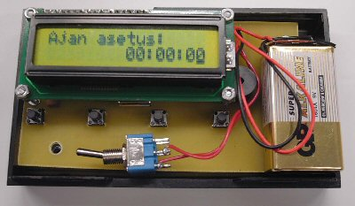

> Tämä projektikuvaus on siirretty tänne elektroniikkakerhon vanhoilta verkkosivuilta.

# Ajastin

[Piirilevyn negatiivi ajastimeen](stuf/AJASTIN_OLUTLASKURI_layout.gif)

[Ajastimen osasijoittelukuva](stuf/AJASTIN_OLUTLASKURI.gif)

[Ajastimen skemat](stuf/SCHEMATIC1_PAGE1.gif)

[Ajastimen hexatiedosto](stuf/Ajastin.hex)

[Ajastimen kääntämätön c-tiedosto](stuf/Ajastin.c)

## Yleistä

Ajastin on Atmelin AVR-sarjan mikrokontrolleriin AT90S2313 perustuva sovellus jota voidaan nimensä mukaisesti käyttää ajastukseen.
Näyttönä laitteessa on Winstar merkkinen LCD-näyttö jossa on kontrollipiirinä Hitachin HD47780:a vastaava piiri. Käyttöliittymänä laitteessa on neljä kytkintä, joista kytkimellä LISÄYS kasvatetaan numeroita, kytkimellä SIIRTO siirretään kursoria, kytkimellä RUN/STOP käynnistetään/pysäytetään aika ja kytkimellä RESET nollataan numerot. Ajan päättymisen laite ilmaisee soittamalla summeria neljä kertaa.

## Laitealusta

Laitealusta on yhteensopiva toisen elektroniikkakerhon projektin, Olutlaskurin uuden version, kanssa. Eli vaihtamalla kontrollerin ohjelmaa voi alustaa käyttää molempiin sovelluksiin. 

Käyttöjännitteensä laite saa 9V paristosta, jonka jälkeen regulaattori säätää jännitteen 5 volttiin. Regulaattorina voi käyttää LM78L05 tai suositeltavammin LM2936 sen pienemmän virrankulutuksen vuoksi. Jälkimmäistä regulaattoria käytettäessä täytyy sen lähdössä olla 10 uF suotokondensaattori. Käyttöjännite tulee suoraan kiinni kontrollerin pinniin VCC ja ylösvetovastuksen kautta nastaan RESET.

Kontrollerin oskillaattorin kellotaajuudeksi on kiteellä valittu 4 MHz ja kide on yhteydessä pinneihin XTAL1 ja XTAL2. Kiteen kanssa on kytketty 2 kpl kondensaattoreita värähtelyn aikaansaamiseksi.

Käyttöliittymän kytkimet ovat kiinni pinneissä PD0-PD3 jotka ovat ohjelmassa määritelty ylösvetovastuksien avulla loogiseen ykköseen (käyttöjännite), ja nappien toinen pää on maapotentiaalissa. Painettaessa nappia pinnien tila muuttuu loogisesta ykkösestä nollaan ja näin saadaan napeilta luettua käyttäjän syöttämää informaatiota.

Ajastimen äänilähde, piezosummeri on plusnavastaan kiinni käyttöjännitteessä ja miinusnavastaan kontrollerin pinnissä PD4 jonka tila on taas ohjelmassa määritelty loogiseksi ykköseksi. Kun PD4 vedetään ohjelmallisesti nollapotentiaaliin, alkaa summerin läpi kulkea virta ja se alkaa soida.

Pinniin PD5 saadaan kiinni anturi (ei käytössä tässä sovelluksessa).

LCD (nestekide) näyttö on yhteydessä pinneihin PB0-PB2 ja PB3-PB7. 

Pinnit PB0-PB2 ovat kiinni LCD-näytön ohjaustuloissa READ SELECT, READ/WRITE ja ENABLE.

READ SELECT tulo määrittelee minkälaista tietoa näytölle annetaanko näytölle käskyjä vai dataa.

Tulo READ/WRITE ohjaa sitä syötetäänkö näytölle dataa vai luetaanko sitä sieltä.

ENABLE tuloon syötetään kellopulssia joka määrää näytölle syötettävän tiedon kirjoitustaajuuden.

Pinnit PB4-PB7 on kytketty LCD näytön datatuloihin DB4-DB7. Näillä syötetään kaikki tieto kontrollerilta näytölle binäärimuodossa. 
Tässä sovelluksessa näyttöä ohjataan neljän bitin ohjauksella, eli kahdeksan bitin binäärisanat on syötettävä näytölle kahdessa osassa.

Pinni PD6 on yhteydessä vastuksen R4 kautta transistorin Q1 kannalle. PD6 tila on määritelty ensiksi nollapotentiaaliin. 
Transistorin kollektori on kiinni vastuksen kautta LCD-näytön taustavalon miinusnastassa BLK ja emitteri maissa. Taustavalon plusnasta BLA on kiinni käyttöjännitteessä. Eli ohjaamalla PD6 jännite saadaan transistori johtavaksi ja taustavalo loistamaan.

LCD-näytön kontrasti säädetään trimmerillä, joka on kiinni nastassa VO.

Kontrollerin pinni PB3 ei ole käytössä tässä sovelluksessa, mutta se on kuitenkin piirilevyllä kiinni ulostulossa. Pinnistä saa ulos PWM (Pulse width modulated, pulssinleveysmoduloitu) signaalia, ja näinollen laitealustalle voi kehittää uusia sovelluksia.

## Kokoamisohjeet

Seuraavat reiät täytyy porata 1mm terällä:

- Lcd-näytön piikkirima
- Potentiometri
- Näppäimistökytkimet

Reiät mistä näyttö tulee kiinni piirilevyyn täytyy porata 2,5mm terällä.

Reiät mistä piirilevy tulee kiinni koteloon täytyy porata 3.5 mm terällä.

Kytkin, anturi ja pwm-ulostulo tulevat erillisten johtojen päihin, jotta niiden liittimet voi kiinnittää koteloon kiinni.

Hyppylanka joka on kiinni pinnissä 15 tulee kiinni Pwm-ulostulon vieressä olevaan padiin. Tätä ei kuitenkaan tässä sovelluksessa tarvita.

Piirilevylle tulee LCD-näytön kohtaan kiinni piikkirima. LCD-näyttö tulee kiinni erilliseen piikkiriman vastakeliittimeen, jotta se saadaan tarvittaessa irrotettua laitteesta. Näyttö asetetaan neljän 2,5mm * 20mm ruuvin varaan muttereiden avulla.

Kontrolleri tulee kiinni kantarimaan.

Napeille täytyy tehdä jatkoholkit jotta niitä voitaisiin käyttää myös kotelon ulkopuolelta. Holkit voi tehdä 9mm muoviputkesta poraamalla niiden päihin 3,5 mm terällä reiät ja mahduttamalla napit reikiin. Putkea löytyy sähkötekniikan osaston työpajalta.

Laite on suunniteltu mahtumaan SP-elektroniikasta löytyvään B10SW koteloon jonka mitat ovat 29 mm * 72 mm * 124 mm.

## Komponenttiluettelo

|Tunnus||
|------|----|
|C2, C1|100n|
|C4, C3|33p|
|C5    |6.8u| 
|C6    |10u|
|IC    |AT90S2313|
|J1    |Paristoneppari|
|J2    |-|
|J3    |Summeri|
|J4    |-|
|LCD4  |LCD-näyttö|
|Q1    |BC337 npn-transistori|
|R1, R2|4k7|
|R4    |2k2|
|R5    |20|
|R6    |Trimmeri 10k|
|SW1   |Näppäimistökytkin|
|SW2   |Näppäimistökytkin|
|SW3   |Näppäimistökytkin|
|SW4   |Näppäimistökytkin|
|SW5   |Virtakytkin|
|U3    |LM2936/LM78L05 regulaattori|
|Y1    |4 MHz|
|LCD4  |16-piikkinen piikkirima|
|1     |Piikkirima vastakeliitin|

## Datalehdet

[AT90S2313_2](stuf/AT90S2313_2.pdf)

[HD47780](stuf/2x16lcdvalo.pdf)

## Ohjelma

Ohjelmointikielenä on käytetty C-kieltä ja kääntäjänä vapaaseen lähdekoodiin perustuvaa WinAVR GCC-kääntäjää. Ohjelma on kirjoitettu ConText- tekstieditorilla ja piirin ohjelmointiin on käytetty PonyProg 2000 ohjelmaa.

Ohjelman suunnittelussa on käytetty ns. vuo/tilakaavioperiaatetta, eli ohjelman toiminta on jaettu erillisiin tiloihin, tilojen sisällä on määritelty tilan toiminta ja siirtymisehto seuraavaan tilaan.

Mikäli haluat tietää enempi mikrokontrollereiden ohjelmoinnista sekä sulautetuista järjestelmistä, tutustu seuraavaan kirjaan ja nettisivustoon:

Pentti Vahtera: Mikro-ohjaimen ohjelmointi C-kielellä

<http://www.microsalo.com>

## Huomautuksia

Ajastimen laskemaan aikaan saattaa tulla virhettä komponenttien toleransseista johtuen.

---

Copyright Jari Savolainen ja Risto Hyypiö
