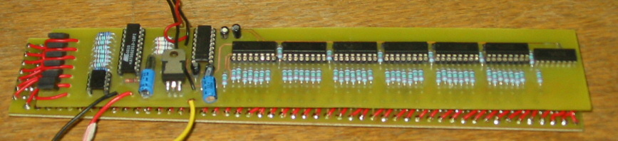

> Tämä projektikuvaus on siirretty tänne elektroniikkakerhon vanhoilta verkkosivuilta.

# Ledinäyttö

[LedDisp_hardware](stuf/LedDisp_hardware.zip)

[Firmware (for AT90S2313)](stuf/LedDisp_AT90S2313_100.zip) Huom. Koodi on käännetty WinAVR:llä.

[LedDisp for Windows binary](stuf/LedDisp_windows_101.zip)

[LedDisp for Windows source code](stuf/LedDisp_windows_101_src.zip) for Borland c++ 6.0

[Rss-parser source file](stuf/parseri.java) Javalla tehty RSS parsin.

### Ominaisuuksia

- 5x70 Lediä
- Sarjaporttiyhteys PC:hen
- Pyörittää, joko staattista ohjelmoitua tekstiä (ilman tietokonetta), tai suoraan tietokoneelta tulevaa tekstiä
- Osaa valita automaattisesti tekstin lähteen
- Suurin kiinteän tekstin pituus on 768 merkkiä
- Ohjelmoitavissa oleva fontti, 256 erilaista merkkiä
- Merkin leveys 0-5 pikseliä + valinnainen ylimääräinen
- Mahdollisuus pyörittää kalevan Uutisotsikoita reaaliajassa

### Kuvia

Ledinäyttö edestä

Ledinäytön elektroniikkaa

Ledinäyttön johdotus

Windowohjelma

Hieman suurempi näyttö

## Laitteen toiminta

### Elektroniikka

Näytössä on seitsemän riviä, joissa jokaisessa 50 lediä. Näytön ohjauselektroniikka koostuu seitsemästä transistorista ja seitsemästä 8-bittisestä siirtorekisteristä, joita kaikkia ohjaa AVR-mikrokontrolleri (AT90S2313). Jokainen transistori ohjaa yhtä riviä ja valitsee onko rivi aktiivinen. Siirtorekisterit on ketjutettu yhteen niin, että niiden sarjamuotoinen tulo muunnetaan 56 rinnakkaiseksi lähdöksi, joista 50 käytetään ohjaamaan näytön sarakkeita. Loput kuusi lähtönastaa ovat käyttämättömiä.

Kontrolleri päivittää näyttöä rivi kerrallaan. Samalla kun yhtä riviä näytetään, seuraavan rivin sisältöä syötetään siirtorekistereille. Kun siirto on valmis, nykyisen rivin ohjaus katkaistaan ja siirtorekistereitä käsketään siirtämään muistissa oleva data lähtöihin. Tämän jälkeen seuraava rivi aktivoidaan antamalla riviä ohjaavalle transistorille tarvittava ohjaus. Edellinen toistetaan satoja kertoja sekunnissa, jolloin saadaan koko kuva näytölle.

Laitteessa on 16 kilobitin EEPROM-muisti (24C16), jota käytetään varastoimaan fontti ja laitteeseen ohjelmoitu kiinteä teksti. Muistiliikennettä hallitsee kontrolleri, joka joko seuraa tietokonelinkin kautta saatuja käskyjä tai toimii itsenäisesti näyttäen kiinteää tekstiä ruudulla toistuvasti.

### Tietokonelinkki

Tietokonelinkki käyttää tavallista sarjaliitäntää (UART, 9600bps, 8 bit, 1 stop bit, no parity) kommunikointiin tietokoneessa olevan ohjelman kanssa. Näyttölaite lähettää tietokoneelle jatkuvasti tietoa kontrollerilla olevan vastaanottopuskurin tilasta. Jokainen lähetetty tavu kertoo kuinka monta tavua puskurissa on vapaata tilaa. Jos puskuri on täysi, mitään ei lähetetä.

Jos laite vastaanottaa tavun tietokoneelta, se tarkistaa onko kyseessä erikoiskomento (kuten tekstin tai fontin ohjelmointikäsky). Jos tavu ei ole komennon aloitusmerkki, sitä käsitellään merkkikoodina, jota vastaava kuva EEPROM:lla olevasta fontista siirretään näyttömuistiin esitettäväksi.
Jos sarjaliikennepuskuri vuotaa yli, viimeiseksi tulleet ylimääräiset tavut hukataan.

## Kalevan uutisotsikot näytölle

Imuroi javalla kirjoitettu sourcetiedosto ja käännä se esim. stektillä. Tämän jälkeen ajat tiedoston omassa kotihakemistossasi ja nettiin ilmestyy osoitteeseen `www.ee.oulu.fi/~tunnus/rss.txt` niminen tiedosto, jonka voit laittaa webreaderiin. Tämän jälkeen otsikot rullaavat näytöllä. Työnalla on myös windowsohjelmaan integroitu versio.

---

Copyright Tuomas Tuononen (nykyinen ohjainlevy), Mikko Kursula (ledien piirilevy), Antti Pohjola (rss-parsin)
