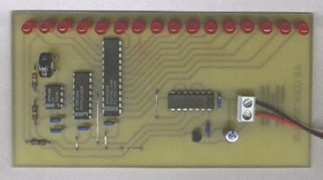

> Tämä projektikuvaus on siirretty tänne elektroniikkakerhon vanhoilta verkkosivuilta.

# Ritariässä

Tässä on 16 ledin ritariässävilkutin.

Osasijoittelukuva ja kuvaus toiminnasta löytyy linkistä [Ritari.pdf](stuf/ritari.pdf).

### Valotusmaskit

[Negatiivi](stuf/rita_neg.pdf)

[Positiivi](stuf/rita_pos.pdf)

Negatiivi on elkerhon piirilevynsyövytyskoneita varten.
