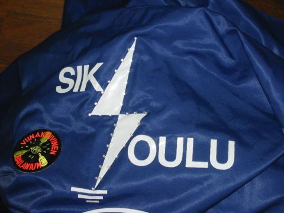
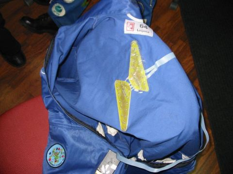

> Tämä projektikuvaus on siirretty tänne elektroniikkakerhon vanhoilta verkkosivuilta.

# Selkäsalama

[Salaman assemblykoodi](stuf/salama5i.asm)

[Salaman hexatiedosto](stuf/salama5i.hex)

Kontrollerin kalvot ja osasijoittelukuvat löytyvät ainakin kerholta. Netistäkin hyvin pian.

### Ohjelmasta

Ohjelman toimintaa ei käydä tässä kovinkaan tarkasti läpi, mutta karkeasti ottaen ohjelma on rakennettu seuraavasti: 

Ledien ohjauksen hoitaa keskeytysrutiini, joka suoritetaan n. 0.1 ms välein. Keskeytysrutiini vaihtaa joka suorituskerralla näytettävää ryhmää. Näin ollen kaikkien 32 ledin päivitystaajuudeksi saadaan n. 2.5kHz. Korkean päivitystaajuuden ansiosta ledien kirkkaudensäätö on mahdollista. Jättämällä ledit osaksi aikaa pimeiksi saadaan ledit palamaan himmeämmin. Toisin sanoen säätämällä ledien päällä- ja poissaoloaikojen suhdetta, saadaan kirkkautta muuteltua.

Keskeytysrutiini mahdollistaa kaksi yhtäaikaista ledin kirkkaustasoa. Lisäksi koko näytön kontrastia voidaan säätää himmeästä kirkkaaseen. PIC:n RAM-muistissa on muistipaikat jokaiselle ledi-ryhmälle, nämä muistipaikat ovat tavallaan eräänlainen näyttömuisti, johon pääohjelma sitten kirjoittaa mitkä ledit ovat päällä ja keskeytysrutiini sitten hoitaa oikeiden ledien sytyttämisen. Näyttömuistissa on erikseen muistipaikat kirkkaana ja himmeämpänä palaville ledeille. Näytön kontrastia voidaan säätää pääohjelmasta kirjoittamalla tiettyyn muistipaikkaan. Keskeytysrutiini säätää näytön kirkkauden sitten muistipaikan osoittamalla tavalla. Pääohjelmalla muodostetaan erilaiset ledien vilkutuskuviot kirjoittamalla näihin näyttömuistipaikkoihin sekä kontrastia säätävään muistipaikkaan. (Tai tarkemmin ottaen pääohjelma kutsuu aliohjelmia, jotka tekevät jonkin vilkutuskuvion.)

### Selkään tulevan piirilevyn yksinkertainen rakenteluohje

Selkään tulee kaksipuolinen piirilevy. Alla on linkit molempiin kalvoihin ja layouttiin.

[Selkäosan päällyskalvo](stuf/topcopper.bmp)

[Selkäosan alakalvo](stuf/botcopper.bmp)

[Selkäosan layout](stuf/layout.bmp)

Tässä on selkään tulevan piirilevyn rakenteluohje. Allekirjoittanut on kokeillut miltä piirilevy selässä tuntuu, ja se on lopulta yllättävän huomaamaton.

Aluksi valotetaan ja syövytetään piirilevy. Maskit ovat tarkkuudella 300DPI.Tarkista ennen valotusta, että ledien paikat kalvolla myötäilevät salaman reunoja selässä.

Kun piirilevy on valmis, se juotetaan seuraavassa järjestyksessä:

 \*  - merkattuihin kohtiin läpiviennit, eli johdonpätkät jotka juotetaan molemmilta puolilta.

1. Läpiviennit  \*->  merkattuihin riveihin

2. Johdotus piirilevyjen väliin (A:sta A:han, B:stä B:hen jne.) Tähän tarkoitukseen lattakaapeli on oiva apuväline. Juota johdot piirilevyllä näkyvien kirjainten puolelle, jolloin johdot jäävät haalarikankaan ja levyn väliin, ja laitteesta tulee varmatoimisempi.

3. PIC-ohjaimelle lähtevä lattakaapeli ylempään puoliskoon. Liittimet A-L on sijoitettu siten, että kaapeli lähtee vasemman olan yli rintataskuun, jossa ohjain kulkee näppärästi mukana. Kaapelia voi juottamisen jälkeen koittaa liimata piirilevyyn jottei juotoksiin kohdistuisi vetoa. Näin juotokset kestävät huomattavasti paremmin.

4. Vasta viimeisenä juotetaan selkään tulevat LED:it. *HUOM!! Tarkista, että ledien napaisuus on oikein päin!!* Napaisuuden voi tarkistaa osasijoittelukuvasta. LED:eissä yleensä pidempi jalka tarkoittaa + puolelle tulevaa jalkaa. LED:it painetaan haalarikankaan läpi piirilevyllä oleviin reikiin ja juotetaan tämän jälkeen kiinni.

5. Lopuksi juotetaan lattakaapelin johdot PIC-ohjaimelle oikeisiin kohtiin. Voit myös juottaa PIC-ohjaimeen sekä lattakaapeliin esim. D-liittimen, jolloin kaapeli on helppo irrottaa ohjaimesta. Ohjaimen skemasta näet oikean johdotuksen.

Tämän jälkeen ei sitten enää muuta kun patteri ohjaimeen kiinni ja bileisiin!

---

Copyright Jani Puumala (Selkäosan piirilevy ja ohjeet)
