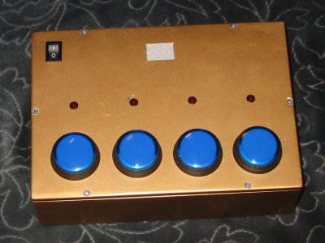
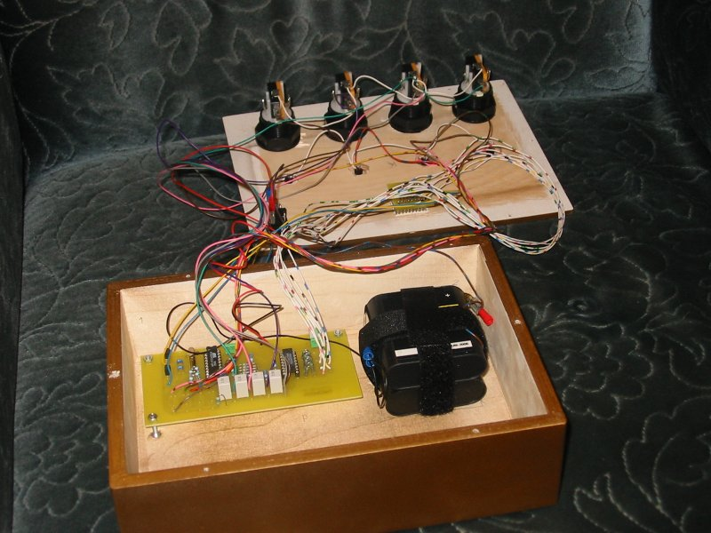

> Tämä projektikuvaus on siirretty tänne elektroniikkakerhon vanhoilta verkkosivuilta.

# AVR Speden Spelit

AVR Speden Spelit on ensimmäinen toimivaksi ja valmiiksi saamani mikrokontrolleriprojekti. Kuten projektin nimikin kertonee, kyse on siitä klassisesta reaktiopelistä, jossa on neljä valollista nappulaa, joista välkkyvät vuoron perään ja pelaajan pitäisi onnistua painamaan nappuloita samassa järjestyksessä. Jotta homma ei menisi liian helpoksi, vilkkuminen nopeutuu pisteiden karttuessa.

Pelin ytimenä toimii Atmelin AT90S2313 tai ATTiny2313-mikrokontrolleri. Ohjelmointi on tehty C-kielellä käyttäen vapaaseen lähdekoodiin perustuvaa WinAVR-ympäristöä, jonka ytimenä on mikrokontrollerikäyttöä varten hieman muokattu avr-gcc -kääntäjä. Kytkentä ei ole monimutkainen, mikrokontrollerin lisäksi tarvitaan vain yksi toinen mikropiiri, siirtorekisteri 74HC595 ja kourallinen passiivikomponentteja.

## Alasivut

Tältä sivustolta löytyy kaikki tarpeellinen materiaali AVR Speden Spelien rakentamiseen ja jos kiinnostusta riittää, toiminnan ymmärtämiseen. Tarjolla on selostukset kytkennän ja ohjelman toiminnoista ja laitteen rakentamisesta, sekä tietysti osaluettelo. Kuvatiedostoissa on syövytysmaskit piirilevyille, laitteen kytkentäkaavio ja osasijoittelukuva.

[Kytkennän toiminta suomeksi](kytkenta.md)

[Operation of the circuit in English](schematic.md)

[Ohjelman toiminta](ohjelma.md)

[Laitteen rakentaminen](kasaaminen.md)

[Osaluettelo](osat.md)

[Kytkentäkaavio](skema.md)

[Osasijoittelukuva](osasijoittelu.md)

[Syövytysmaskit pääpiirilevylle ja näytön piirilevylle](maskit.md) (resoluutiolla 508 dpi)

## Lähde

[Ohjelman lähdekoodi](stuf/spelit.c)

[Käännetty koodi](stuf/spelit.hex)

[ATTinylle käännetty koodi](stuf/tinyspelit.hex)

---

Copyright Antti Gärding 2003, 2004

Edit (ATTinylle) Jani Ylioja 2009-2011
