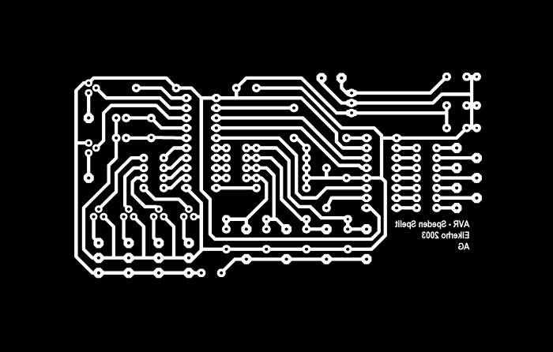
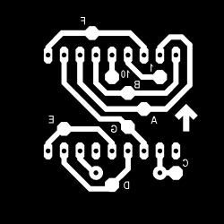

> Tämä projektikuvaus on siirretty tänne elektroniikkakerhon vanhoilta verkkosivuilta.

[Projektin etusivu](README.md)

Tässä näkyvät kuvat on tallennettu gif-formaatissa heikolla resoluutiolla. Linkit johtavat kunnollisiin maskeihin, jotka on tallennettu resoluutiolla 508 dpi eli 200 dpcm tif-formaattiin.

[Pääpiirilevy](stuf/maski.tif)

[Näytön piirilevy](stuf/nayttomaski.tif)

---

Copyright Antti Gärding 2004
