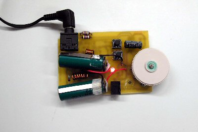

> Tämä projektikuvaus on siirretty tänne elektroniikkakerhon vanhoilta verkkosivuilta.

# Taskuradio

[Piirilevyn negatiivi taskuradioon](stuf/TASKURADIO_SMD_LAYOUT.gif)

[Osasijoittelukuva päältä](stuf/Taskuradio_smd_top.gif)

[Osasijoittelukuva alta](stuf/Taskuradio_smd_bot.gif)

[Taskuradion scemat](stuf/SCHEMATIC1_PAGE1.gif)

## Yleistä

Laitteen toiminta perustuu Philipsin TDA-7088 vastaanotinpiiriin, joka ottaa RF (Radio Frequency)-taajuisen FM (Frequency Modulated) signaalin ja purkaa signaalista audiosignaalia. Laitteella voi kuunnella 90-110 Mhz taajuudella kuuluvia FM radiokanavia.

Radiossa on digitaalinen viritys, painettaessa RUN nappia alkaa laite pyyhkäisemään taajuusaluetta ylöspäin ja pysähtyy mikäli löytää aseman. Päästyään taajuusalueen ylälaitaan voi virityksen nollata painamalla RESET- nappia jolloin virityspiiri lähtee hakemaan kanavia uudestaan taajuusalueen alalaidasta. Äänenvoimakkuuden säätöön on radiossa säätövastus joka toimii samalla virtakytkimenä. Jännitelähteenä laitteessa on sarjaankytkettynä kaksi 1.2 voltin akkua. Näitä voi ladata 3.6V matkapuhelimen laturilla.

## Toimintakuvaus

> kts. datalehden lohkokaavio

**Datalehdet:**

[TDA7050T_SMD](stuf/TDA7050T_SMD.pdf)

[TDA7088](stuf/TDA7088.pdf)

RF-taajuisen ( MHz- luokka) signaalin piiri saa kuulokkeiden maajohdon kautta. Siitä se johdetaan  on LC- kaistanpäästösuodattimelle joka rajoittaa RF- signaalin taajuuskaistan 90-110 MHz:n nurkille. Tämä siksi, että kuulokejohdossa kulkee kohinaa (signaalia jossa on kaikkia taajuuksia) ja suodattimella suodatetaan vain halutut taajuudet ( ne joissa hyötysignaali kulkee). Suodattimen jälkeen signaali menee piirin TDA-7088 pinneihin 11 ja 12 ja sitä myöten sekoittimeen (MIXER).

Sekoittimeen johdetaan myös toisen laitteessa olevan lohkon, paikallisoskillaattorin, signaali. Paikallisoskillaattorin taajuus määrätään pinneissä 4 ja 5 kiinni olevan LC-suodattimen resonanssitaajuudella. Suodattimeen kuuluu kela, kondensaattori ja kapasitanssidiodi. Kapasitanssidiodi toimii kuin kondensaattori, jonka kapasitanssin määrää sen yli oleva jännite. Eli diodin yli olevaa estosuuntaista jännitettä muuttamalla saadaan suodattimen ja sitä kautta paikallisoskillaattorin taajuutta muutettua.

Sekoittimessa FM- taajuus sekoitetaan paikallisoskillaattoritaajuuden kanssa jolloin FM-taajuinen signaali siirtyy näiden taajuuksien erotuksena olevalle taajudelle. Esim. Paikallisoskillaattoritaajuus on 97.3 MHz ja FM-signaali 100 MHz jolloin sekoittimesta ulostuleva signaali on 70 KHz taajuudella. Tätä kutsutaan välitaajuiseksi signaaliksi.

Sekoittimen jälkeinen välitaajuinen signaali menee suodattimelle, joka suodattaa siitä lisää tarpeettomia taajuuksia pois ja rajoittimelle (LIMITER) joka rajoittaa signaalin tasoa eli amplitudia.

Seuraava lohko, Demodulaattori purkaa välitaajuisesta signaalista audiotaajuisen signaalin esille. Demodulaattori nimensä mukaisesti demoduloi taajuusmoduloidusta signaalista amplitudimoduloidun signaalin f-v (taajuus-jännite) muunnoksella.

Tämän jälkeen signaali on jo normaalia kuultavaa puhetta ja musiikkia, eli valmista vahvistettavaksi ja ajettavaksi kuulokkeisiin Audiosignaalia saadaan ulos pinnistä 2.

TDA-7088:n ominaisuuksiin kuuluu digitaalinen viritys. Virityslohko tutkii audiotaajuisen signaalin tasoa ja sitä mukaa muuttaa pinnin 16 jännitettä. Tällöin muuttuu kapasitanssidiodin kapasitanssi joka taas muuttaa paikallisoskillaattorin taajuutta. Mikäli sekoittimen kautta Demodulaattoriin ja siitä eteenpäin audiotaajuudelle siirtyvä signaali on tarpeeksi vahva (eli tällä taajudella on jokin lähetys), pysäyttää virityslohko pinnin 16 jännitteen ja täten asettaa paikallisoskillaattorin taajuuden.

Audiosignaali ajetaan trimmerin (säätövastus) kautta Philipsin TDA 7050 vahvistimeen, joka on ns. siltakytketty. Trimmerillä määrätään vahvistimelle menevän signaalin amplitudi, eli äänenvoimakkuus. Vahvistin on ns. siltakytketty (kts. TDA7050 datalehti), ja kuulokkeet on kytketty vahvistimen kanssa sarjaan.

Vahvistimen jälkeen on vielä kelat molempien lähtöjen jälkeen sarjassa. Näillä pyritään estämään kuulokejohdossa (joka toimii myös radion antennina) olevan suurtaajuisen signaalin kytkeytyminen vahvistimen lähtöihin ja sitä kautta piiriin.

## Kokoamisohjeet

Laite on pääosin toteutettu pintaliitoskomponenteilla koska siitä on haluttu mahdollisimman pienikokoinen. Tämä tekeekin siitä hankalan ja oikosuluille alttiin juottaa ja kasata. Kokoaminen vaatii teräväkärkisen kolvin sekä huolellisuutta ja tarkkuutta

Seuraavien läpivientikomponenttien reiät kannattaa porata piirilevylle 1mm terällä jotta niiden jalat mahtuisivat rei\`istä läpi. 
Liittimiin täytyy porata reiät pinnien ja tukitappien kohtiin:

- Kytkimet SW2 ja SW3
- Laturiliitin J1
- Kuulokeliitin J2
- Kelat L1 ja L2

Muut reiät voi porata 0.8 mm terällä (yleisin teräkoko).

Potentiometri täytyy kiinnittää erillisillä jaloilla piirilevyyn.

### Pintaliitoskomponenttien juottamisesta

Sulata juotettavaan padiin pieni kerros tinaa ja aseta tämän jälkeen komponentti pinseteillä paikoilleen. Lämmitä komponenttia ja tinakerrosta kunnes tina tarttuu komponentin pintaan.

IC:t (integrated circuit, integroitu piiri) kannattaa kohdistaa kunnolla keskelle padeja ja sitten juottaa vastakkaisista jaloista kiinni.

### Ilmasydämisten kelojen teko

Pyöritä 5mm halkaisijaltaan olevan ruuvimeisselin ympäri 6 kierrosta kuparilankaa jonka paksuus on 0.8mm. Tämän jälkeen raaputa kelojen jaloista suojalakka pois, jotta voit juottaa ne piirilevyyn. Varo kuitenkin vaurioittamasta keloissa olevaa lakkaa.

Mikäli radion kuuluvuus on huono, täytyy paikallisoskillaattorin kelaa L1 säätää venyttämällä sitä hiukan. Oikea leveys on n.0.8 - 1.2 cm

Napeille täytyy tehdä jatkoholkit jotta niitä voitaisiin käyttää myös kotelon ulkopuolelta. Holkit voi tehdä 9mm muoviputkesta poraamalla niiden päihin 3,5 mm terällä reiät ja mahduttamalla napit reikiin. Putkea löytyy sähkötekniikan osaston työpajalta.

Radioon tulee kaksi 1.2 voltin akkua sarjaankytkettynä. Akkuja löytyy elkerhon kaapista.

Laite on suunniteltu mahtumaan SP-elektroniikasta löytyvään B760 koteloon, jonka mitat ovat 27 mm * 50 mm * 75 mm.

## Osaluettelo

> kaikki muut pintaliitoskomponentteja paitsi merkityt

**Kondensaattorit:**
|Kondensaattori||
|----|----|
|C1  |100n|
|C2  |100n|
|C12 |100n|
|C14 |100n|
|C15 |100n|
|C19 |100n|
|C3  |3.9n|
|C4  |330p|
|C5  |180p|
|C6  |3.3n|
|C7  |82p| 
|C8  |680p|
|C9  |68p|
|C10 |22n|
|C11 |10n|
|C13 |220p|
|C16 |1.8n|
|C17 |1n|
|C18 |470p|
|C20 |6.8u (läpivienti)|

**Diodit:**
|Diodi||
|--|------------------|
|D1|BB909 (läpivienti)|
|D2|Led	(läpivienti)|
|D3|Zenerdiodi|

**IC:t**
|IC||
|---|-------|
|IC1|TDA7088|
|IC2|TDA7050|

**Liittimet:**
|Liitin||
|--|-------------------------|
|J1|Laturiliitin (läpivienti)|
|J2|Kuulokeliitin(läpivienti)|
|J3|Akut (läpivienti)|

**Kelat:**
|Kela||
|--|-----------------|
|L1|70nH (läpivienti)|
|L2|78nH (läpivienti)|
|L5|5.6uH (läpivienti)|
|L6|5.6uH (läpivienti)|

**Vastukset:**
|Vastus||
|--|---|
|R1|100|
|R2|10k|
|R4|5.6k|
|R5|1k|
|R6|20k|
|R8|10k logaritminen säätövastus|
|SW3|Näppäimistökytkin (läpivienti)|
|SW2|Näppäimistökytkin (läpivienti)|

---

Copyright Jari Savolainen
