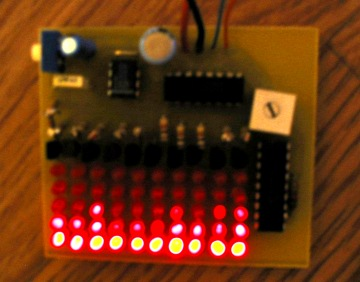

> Tämä projektikuvaus on siirretty tänne elektroniikkakerhon vanhoilta verkkosivuilta.

# VU-meter

### Kytkennän toiminta

555-ajastinpiiri oheiskomponentteineen antaa 4017-kymmenlaskurille R12-trimmerillä säädettävän kellotaajuuden. 4017 antaa vuorotellen jännitettä jokaiseen kymmeneen lähtöönsä ja ohjaa siis ledisarakkeita. Transistorit toimivat emitteriseuraajina ja vahvistavat virtaa, etteivät ledit kuormittaisi liikaa mikropiiriä.

LM3914-mikropiiri sytyttää INPUT-liitännästä saamaansa jännitteeseen verrannollisen määrän ledejä siltä sarakkeelta, mille laskurikytkentä antaa jännitettä. Samalla 3914 säätää ledien virran sopivaksi. R14-trimmerillä voidaan säätää ledien syttymisherkkyyttä.

Kun kytkentä on oikein koottu ja sopivasti säädetty, se piirtää musiikin mukaan sykkiviä eri mittaisia ledipalkkeja niin nopeasti, ettei silmä ehdi kunnolla havaita välkkymistä. Liian hitaalle säädettynä kytkentä piirtää vain sykkivää ledipalkkia, joka etenee sarakkeelta toiselle. Liian nopealle säädettynä kaikki palkit näyttävät sykkivän tismalleen samaan tahtiin.

[Video](https://www.youtube.com/watch?v=4kciCH-6Jys)

[ledien kytkentäkaavio](stuf/vu-pyyhkaisy_ledit_kytkis.png)

[Piirilevy alta](stuf/vu-pyyhkaisy_ledit_piirilevy_bottom_mv.png)

[Piirilevy päältä](stuf/vu-pyyhkaisy_ledit_piirilevy_top_mv.png)

[Ledien sijoittelu](stuf/vu-pyyhkaisy_ledit_sijoittelu.png)

[Ohjauksen kytkentäkaavio](stuf/vu-pyyhkaisy_ohjaus_kytkis.png)

[Ohjauksen osasijoittelukuva](stuf/vu-pyyhkaisy_ohjaus_osasijoittelu.png)

[Piirilevyn syövytyskuva](stuf/vu-pyyhkaisy_ohjaus_piirilevyn_syovytyskuva.png)

### Osaluettelo

|Tunnus|Kuvaus                        |
|------|------------------------------|
|C2    |100uF/10V elko                |
|C3    |1uF/10V elko                  |
|C4    |100nF polko                   |
|C6    |100nF polko                   |
|IC1   |4017N/DIL16                   |
|IC2   |NE555N/DIL08                  |
|IC3   |LM3914N/DIL18                 |
|JP1   |jumpperi tai vaihtokytkin     |
|R1-R10|1k                            |
|R11   |620                           |
|R12   |14k trimmeri tai potentiometri|
|R13   |20k                           |
|R14   |1k trimmeri tai potentiometri |
|R17   |100k                          |
|T1-T10|BC547C                        |

### Vinkkejä

C6 ja R17 toimivat alkuperäisessä kytkennässä ylipäästösuotimena, mutta tarvittaessa niistä saadaan alipäästösuodin vaihtamalla vastuksen ja kondensaattorin paikkaa. Komponenttien arvoja muuntelemalla voidaan säätää jakotaajuutta.

JP1-jumpperilla/kytkimellä valitaan, halutaanko käyttää tavallista jännitteen mukaan nousevaa ledipalkkia vai halutaanko sytyttää vain palkin ylin ledi.

Kun kytkentä koteloidaan, potentiometrit ja kytkin kannattaa kytkeä johtojen päähän, jolloin kotelon muodon ja säätimien sijoituksen voi valita vapaammin.

Mikäli kytkentää haluaa viritellä ja kehitellä enemmänkin, lienee hyödyllistä tutustua kytkennässä käytettyjen mikropiirien datasivuihin. Ne löytyvät osoitteista:

[LM3914.pdf](http://www.national.com/ds/LM/LM3914.pdf)

[4017.pdf](http://www.doctronics.co.uk/pdf_files/4017.pdf)

[LM555.pdf](http://www.national.com/ds/LM/LM555.pdf)
